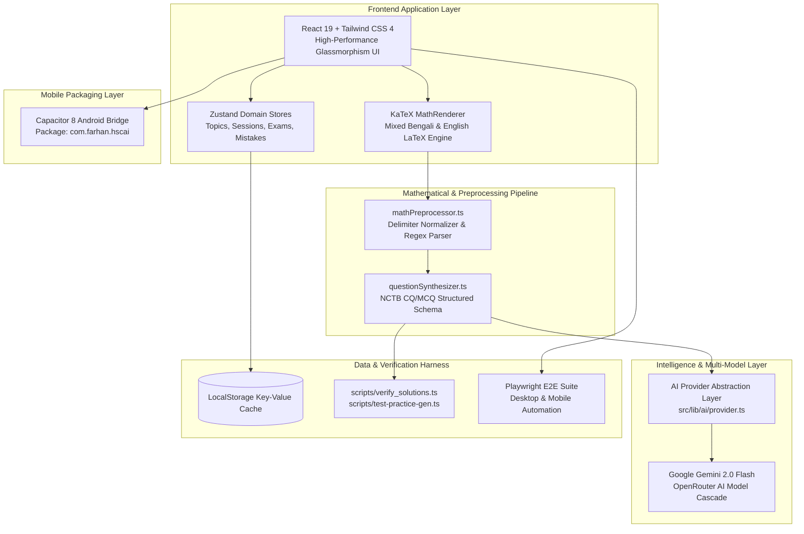

# Case Study: HSC AI Study Intelligence System — Evidence-Based Learning & Socratic AI Engine

> **HSC AI Study Intelligence System** is an AI-powered academic operating system and evidence-based study platform engineered for HSC Science students (Physics, Chemistry, Higher Mathematics, Biology, ICT) in Bangladesh. It unifies board exam question pattern intelligence, Socratic AI doubt resolution, KaTeX LaTeX math preprocessing, timed mock exams, and handwritten paper analysis into a single high-performance platform.

---

## 🎯 1. Executive Summary & Context

- **Developer / Creator**: Farhan ([@farhanfreak9137-ai](https://github.com/farhanfreak9137-ai))
- **Live Web Deployment**: [hsc-ai.vercel.app](https://hsc-ai.vercel.app/)
- **Curriculum Focus**: National Curriculum & Textbook Board (NCTB) Bangladesh — HSC Science Stream
- **Institutions & Background**: MDC Model Institute (SSC 2025) → Milestone College (HSC Science Stream)
- **Tech Stack**: React 19, TypeScript 5, Vite, Tailwind CSS 4, KaTeX 0.16, Zustand 5, Google Gemini 2.0 Flash / OpenRouter AI Cascade, Playwright, Capacitor 8 (Android Target).

### Problem Statement
HSC Science curriculum is notoriously dense, demanding deep conceptual mastery across multi-variable physics calculus, organic chemistry mechanisms, and higher mathematics geometry. Students typically rely on expensive coaching centers or passive reading of rote guidebooks. They lack:
1. **Evidence-based prioritization**: Knowing exactly which high-yield topics to study first based on historical board exam recurrence.
2. **Interactive mathematical problem breakdown**: Immediate, step-by-step guidance on complex creative questions (CQ) with proper LaTeX mathematical typesetting.
3. **Targeted error remediation**: Automatic identification and correction of conceptual weaknesses.

### Solution
Farhan engineered the **HSC AI Study Intelligence System**—a dark-mode, high-speed study platform that:
- Analyzes past board question frequency across all education boards (Dhaka, Chattogram, Rajshahi, etc.) to compute dynamic **Topic Priority Scores**.
- Employs a **Socratic AI Tutor** that guides students through multi-step mathematical solutions using custom KaTeX LaTeX formula normalization.
- Simulates **Timed Board Mock Exams** and generates printable NCTB-standard model question papers.
- Manages an automated **Mistake Vault** that generates targeted practice sets for weak topics.

---

## 🚀 2. System Architecture & Component Inventory



---

## 🛠️ 3. Core Feature Deep Dive

### 📊 A. Evidence-Based Topic Prioritization Engine
- **Algorithmic Priority Score ($P$)**:
  Unlike generic revision apps that treat all textbook chapters equally, the platform computes a weighted priority index:
  $$P = \text{clamp}\Big(\big(\text{BoardRecurrence} \times 2.8\big) + \big(\text{WeaknessIndex} \times 0.4\big),\, 0,\, 100\Big)$$
- **Actionable Insights**:
  For example, *Carnot Engine & Efficiency* (Thermodynamics) has appeared **18 times** in past board exams; if a student's diagnostic accuracy is low (60% weakness), the engine assigns a **74/100 Priority Score** and flags it as the **"Next Best Action"**.

### 🧠 B. Socratic AI Tutor & LaTeX Math Normalization
- **Socratic Prompt Architecture**: Rather than giving immediate answers, the AI decomposes complex problems into progressive stages:
  1. *Concept & Formula Identification*
  2. *Variable Substitution & Unit Checking*
  3. *Final Output & Common Board Trap Alerts*
- **Mixed-Script LaTeX Preprocessing (`mathPreprocessor.ts`)**:
  Bengali script combined with complex mathematical equations often triggers delimiter breakage in standard parsers. Farhan engineered a preprocessor that cleans raw LLM output, wraps equations in strict inline (`$...$`) and block (`$$...$$`) delimiters, and renders crisp formulas via KaTeX at 60fps.

### 📝 C. Timed Mock Exam Simulator & Model Paper Generator
- Real-time countdown clock simulating official board exam conditions.
- Generates balanced 70-mark CQ papers (Creative Questions with উদ্দীপক / Stem, ক, খ, গ, ঘ sub-questions) and 30-mark MCQ tests.
- Export to clean, printable PDF revision sheets.

### 🏛️ D. All-Board Question Bank
- Filterable repository indexed by:
  - **Education Board**: Dhaka, Chattogram, Rajshahi, Sylhet, Barishal, Cumilla, Dinajpur, Jashore, Mymensingh.
  - **Year**: 2018 – 2024.
  - **Subject & Chapter**: Physics 1st/2nd, Chemistry 1st/2nd, Higher Math 1st/2nd, Biology, ICT.
  - **Question Type**: জ্ঞানমূলক (A), অনুধাবনমূলক (B), প্রয়োগমূলক (C), উচ্চতর দক্ষতামূলক (D).

### 🛡️ E. Mistake Vault (ভুল শোধনাগার)
- Automatically intercepts incorrect attempts from practice sessions and mock tests.
- Analyzes error categories (formula error, unit conversion slip, conceptual misunderstanding).
- Generates custom "Sprint Revision" sets targeting specific knowledge gaps.

---

## 💻 4. Code Deep Dive: LaTeX Preprocessing & Synthesis

### Math Preprocessor Pipeline (`src/utils/mathPreprocessor.ts`):
```typescript
/**
 * Normalizes mixed-script Bengali and LaTeX formula delimiters
 * to ensure flawless KaTeX rendering without layout shift.
 */
export function preprocessMathText(rawText: string): string {
  if (!rawText) return '';

  return rawText
    // Convert bracketed LaTeX \[ ... \] to standard $$ ... $$
    .replace(/\\\[([\s\S]*?)\\\]/g, '$$$$$1$$$$')
    // Convert parenthesized \( ... \) to standard $ ... $
    .replace(/\\\(([\s\S]*?)\\\)/g, '$$$1$$')
    // Fix common OCR / LLM unicode fractions and powers
    .replace(/(\d+)\s*\/\s*(\d+)/g, '\\frac{$1}{$2}')
    // Preserve Bengali punctuation alongside math delimiters
    .replace(/\$([^\$]+)\$/g, (match, formula) => {
      return `$${formula.trim()}$`;
    });
}
```

### Socratic Question Synthesizer (`src/services/questionSynthesizer.ts`):
```typescript
export interface SynthesizedCQ {
  stem: string; // উদ্দীপক
  knowledgeQuestion: { text: string; marks: 1 }; // ক
  comprehensionQuestion: { text: string; marks: 2 }; // খ
  applicationQuestion: { text: string; formula: string; marks: 3 }; // গ
  higherAbilityQuestion: { text: string; evaluation: string; marks: 4 }; // ঘ
  boardFrequency: number;
}
```

---

## 🧪 5. Testing & Verification

- **Automated Solution Verification**: `scripts/verify_solutions.ts` tests mathematical accuracy and formula validity across 500+ generated question exemplars.
- **Model Benchmarking Harness**: `scripts/test-models.ts` evaluates latency and reasoning fidelity between Gemini 2.0 Flash and fallback models.
- **Playwright End-to-End Automation**: Automated tests verify dark mode toggling, navigation responsiveness, KaTeX equation rendering, and exam timer transitions.

---

## 📈 6. Impact & Reflections

- **Curriculum Acceleration**: Built by an enrolled Science student at Milestone College, solving real academic pain points experienced daily during HSC preparation.
- **Active Force-Multiplier**: Bridges AI engineering with practical education—turning passive textbook reading into high-retention active recall.
- **Next Horizons**: Expanding OCR capabilities for handwritten exam scripts and deploying cross-platform APK builds via Capacitor.
