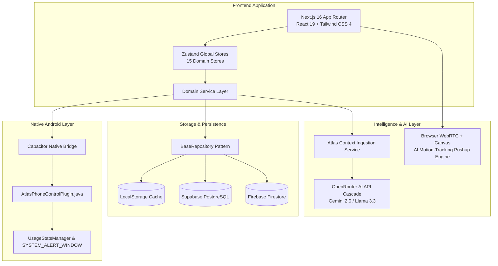

# Case Study: Atlas — Personal AI Operating System & Digital Discipline Platform

> **Atlas** is a cross-platform personal AI operating system and life management ecosystem built to combat digital distraction, optimize daily productivity, and enforce screen-time discipline using real-time AI camera motion tracking.

---

## 🎯 1. Executive Summary & Context

- **Developer / Creator**: Farhan ([@farhanfreak9137-ai](file:///c:/Atlas/atlas/AGENTS.md))
- **Live Web Deployment**: [atlas-aa7q.vercel.app](https://atlas-aa7q.vercel.app/)
- **Native Target**: Android App (Package ID: `com.farhan.atlas` via Capacitor 8)
- **Tech Stack**: Next.js 16 (Static Export), React 19, TypeScript 5, Tailwind CSS 4, Zustand 5, Supabase, Firebase, OpenRouter AI API, Playwright, Java (Android Native).

### Problem Statement
Personal productivity was breaking down due to fragmented life-tracking tools and pervasive smartphone addiction ("doom scrolling"). Existing app blockers were easily bypassed, lacking meaningful friction or personal context to curb digital distractions.

### Solution
Atlas unifies daily task execution, habit building, goal progress, study sessions, gym workouts, and sports performance into a single dark glassmorphism dashboard. To solve doom scrolling, Atlas pairs native Android screen-time limits with an **AI-powered physical barrier**: users must perform verified camera pushups to unlock temporary phone time.

---

## 🚀 2. System Architecture & Component Inventory



---

## 🛠️ 3. Core Feature Deep Dive

### 🤖 A. Personal AI Companion ("Atlas AI")
- **Dynamic System Context Ingestion**: Unlike generic AI chatbots, Atlas compiles the user's complete profile (bio, physical metrics, DOB, location) along with live task counts, habit completions, goal progress, study hours, gym workouts, and recent journal entries into the AI prompt window.
- **Configurable Prompt Controls**:
  - **Verbosity Slider**: Ranges from ultra-concise 1-2 sentence replies to comprehensive deep-dive analyses.
  - **Creative vs. Precise Mode**: Adjusts model temperature ($0.9$ vs. $0.3$).
  - **Conversation Memory**: Maintains 10-turn sliding context window.
- **Resilient Model Cascade**: Automatically falls back through multiple models via OpenRouter:
  1. `openrouter/free`
  2. `google/gemini-2.0-flash-lite-001`
  3. `meta-llama/llama-3.3-70b-instruct:free`
  4. `google/gemini-flash-1.5:free`

### 🏋️ B. Physical Screen Time Enforcement & AI Motion Tracking
- **Native Android Discipline**:
  - Configurable daily limit (minimum 15 mins) & wake timeout controls.
  - Category presets (Social Media, Games, Streaming, Short Video Reels) & custom package blacklisting (`customBlockedPackages`).
  - Bedtime quiet-hours schedule locking.
- **Computer Vision Pushup Counter**:
  - Built directly into the browser/webview using HTML5 WebRTC `<video>` and high-frequency `<canvas>` frame processing.
  - Performs top-region luminance variance analysis to detect body lowering and rising phases.
  - Grants a strict 15-minute emergency phone window only upon completing the designated rep target (e.g. 20 pushups).

### 📊 C. Unified Life Management Modules
- **Task Management**: Priority matrix (`high`, `normal`, `low`), due dates, categories, completion analytics.
- **Habit Tracking**: Daily completion logs, streak calculations, productivity index contribution.
- **Goal Management**: Sub-goal milestones, completion percentages, target deadlines.
- **Study Hub**: Subject organizer, timed study sessions with 1-5 focus ratings, exam grade logger, GPA & study streak analytics.
- **Gym Logger**: Default & custom exercise library, workout logging (sets, reps, weight), PR max weight tracking, weekly volume metrics ($\text{sets} \times \text{reps} \times \text{weight}$).
- **Football Performance Tracker**: Match logger (goals, assists, rating 1-10, result), training duration logs, win rate analytics.
- **Notes & Journal**: Structured note taking, quick journal entries that auto-populate the AI companion's memory.

---

## 📱 4. Android Native Plugin Implementation

Atlas bridges the web interface with native Android system APIs via Capacitor:

```java
@CapacitorPlugin(name = "AtlasPhoneControl")
public class AtlasPhoneControlPlugin extends Plugin {
    // 1. Checks Usage Access & Overlay permissions
    @PluginMethod
    public void checkPermissions(PluginCall call) { ... }

    // 2. Opens Android Settings for Usage Access
    @PluginMethod
    public void requestUsageAccess(PluginCall call) { ... }

    // 3. Opens System Alert Window Settings for Overlay Lockscreen
    @PluginMethod
    public void requestOverlayPermission(PluginCall call) { ... }

    // 4. Queries UsageStatsManager for daily foreground app screen time
    @PluginMethod
    public void getTodayScreenTimeMinutes(PluginCall call) { ... }

    // 5. Queries PackageManager for launchable installed app packages
    @PluginMethod
    public void getInstalledApps(PluginCall call) { ... }
}
```

### Android Manifest Permissions ([AndroidManifest.xml](file:///c:/Atlas/atlas/android/app/src/main/java/com/farhan/atlas/AndroidManifest.xml)):
- `PACKAGE_USAGE_STATS`: Read daily foreground application usage.
- `SYSTEM_ALERT_WINDOW`: Render full-screen lockout overlay window over blacklisted apps.
- `FOREGROUND_SERVICE`: Enable background monitoring service.
- `INTERNET`: Sync data and communicate with OpenRouter / Supabase.

---

## 🧪 5. Testing & Deployment Configuration

- **Next.js Static Export**: Configured with `output: "export"` and `images: { unoptimized: true }` in [`next.config.ts`](file:///c:/Atlas/atlas/next.config.ts) to produce static assets for Vercel edge deployment and Capacitor Android packaging.
- **Playwright E2E Testing**: Automated browser tests ([`tests/atlas.spec.ts`](file:///c:/Atlas/atlas/tests/atlas.spec.ts) and [`e2e/chat.spec.ts`](file:///c:/Atlas/atlas/e2e/chat.spec.ts)) verify route integrity, console error freedom, and UI element stability across desktop and mobile viewports.

---

## 📈 6. Impact & Lessons Learned

- **Behavioral Impact**: Physical pushup verification created the ideal friction barrier—requiring physical effort before spending time on distracting apps dramatically curbed impulse phone usage.
- **Friend Group Validation**: Initially built for personal discipline, the app is currently utilized by the creator and their inner circle of friends as a daily accountability tool.
- **Key Takeaway**: Combining personal life context with AI intelligence transforms a standard utility app into an active "companion OS" that keeps users accountable to their personal goals.
